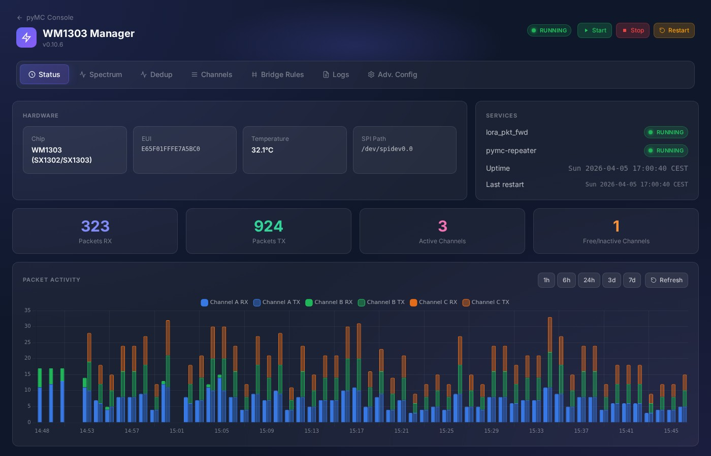
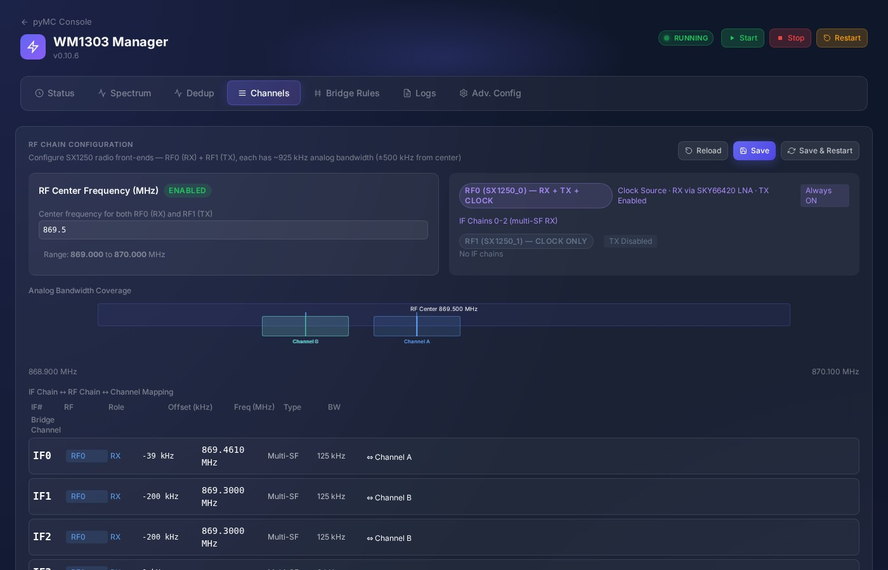
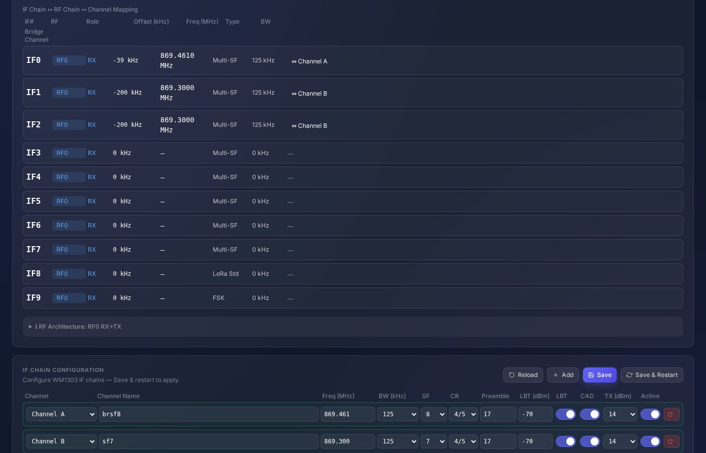
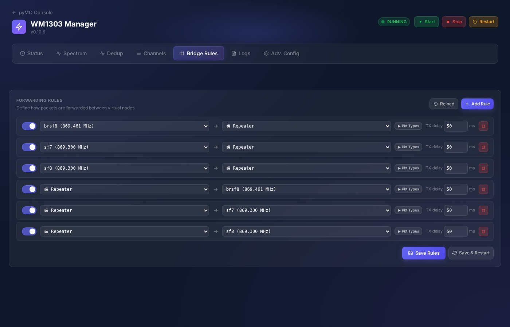
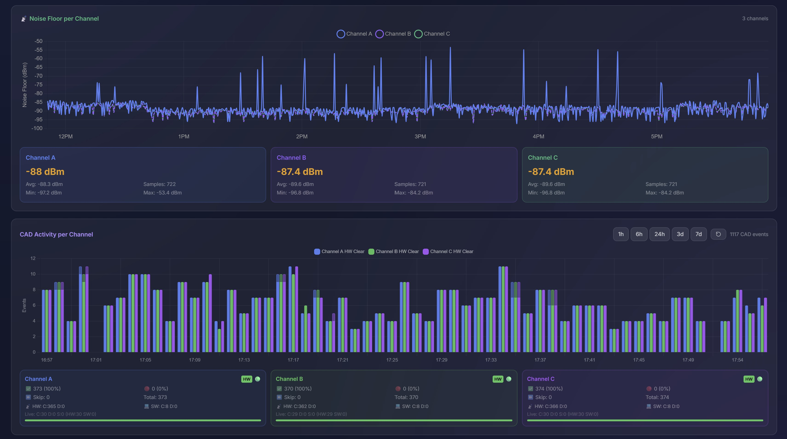
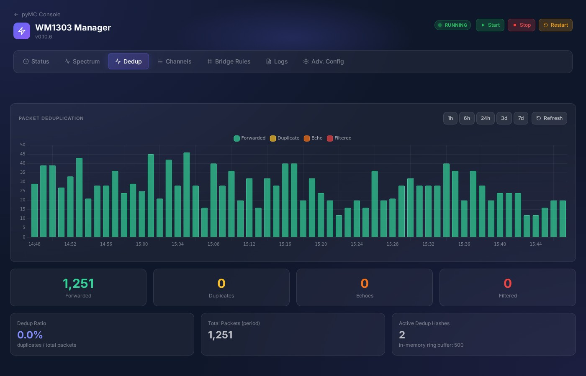

# pyMC WM1303 — LoRa Multi-Channel Bridge/Repeater

> Turn a SenseCAP M1 into a MeshCore multi-channel LoRa bridge and repeater

## What Is This?

This project transforms a **SenseCAP M1** (Raspberry Pi 4 + WM1303 LoRa concentrator HAT) into a **5-channel MeshCore bridge and repeater**. It bridges up to 5 simultaneous LoRa channels with independent frequency, bandwidth, and spreading factor configurations, so MeshCore nodes on any channel can communicate through the repeater.

## 5-Channel Architecture

| Channel | Radio | Max Bandwidth | Notes |
|---------|-------|--------------|-------|
| **Channel A** | SX1302 → SX1250 | 125 kHz | Concentrator IF chain |
| **Channel B** | SX1302 → SX1250 | 125 kHz | Concentrator IF chain |
| **Channel C** | SX1302 → SX1250 | 125 kHz | Concentrator IF chain |
| **Channel D** | SX1302 → SX1250 | 125 kHz | Concentrator IF chain |
| **Channel E** | SX1261 | 62.5 kHz | Companion radio — sub-125 kHz support |

Channels A–D use the SX1302 concentrator's multi-channel demodulators. Channel E uses the SX1261 companion chip, enabling sub-125 kHz bandwidths that the concentrator cannot handle.

> **Tip:** Fewer active channels = more stable operation. 4 channels maximum is recommended.

## Key Features

- **Multi-channel bridging** — Route packets between channels with configurable rules
- **Channel E / SX1261** — Full RX/TX on the companion radio with 62.5 kHz bandwidth support
- **Per-channel TX queues** — FIFO with fair round-robin scheduling, LBT, CAD gating
- **3-layer deduplication** — Self-echo, multi-demod, and cross-channel hash dedup
- **Spectral scan & noise floor** — Continuous monitoring via SX1261 without blocking TX
- **Web management UI** — Real-time status, channel config, bridge rules, spectrum charts
- **REST API + WebSocket** — Full programmatic control with real-time event streaming
- **SSOT configuration** — Single source of truth model (`wm1303_ui.json`)
- **One-command install** — Automated installation and upgrade scripts
- **SPI optimized** — 16 MHz clock, 16 KB burst transfers for low-latency radio I/O

## Quick Start

### Prerequisites

- SenseCAP M1 (or Raspberry Pi 4 with WM1303 HAT)
- Raspberry Pi OS Lite (Bookworm or newer)
- SSH access and internet connectivity

### Installation

```bash
git clone https://github.com/HansvanMeer/pyMC_WM1303.git
cd pyMC_WM1303
sudo bash install.sh
```

The script handles system updates, dependencies, HAL compilation, Python setup, and service configuration. Takes 15–30 minutes.

### Access the UI

```
http://<pi-ip>:8000/wm1303.html
```

### Upgrade

```bash
curl -sSL https://raw.githubusercontent.com/HansvanMeer/pyMC_WM1303/main/upgrade_bootstrap.sh | sudo bash
```

Or manually:
```bash
cd ~/pyMC_WM1303 && git pull && sudo bash upgrade.sh
```

## Screenshots

| Screenshot | Description |
|-----------|-------------|
|  | Status tab — channel overview and system health |
|  | Channel configuration — IF channels (A–D) |
|  | Channel configuration — SX1261 channel (E) |
|  | Bridge rules management |
|  | Spectrum tab — noise floor, CAD, LBT charts |
|  | Deduplication event visualization |

## Architecture Overview

```
┌──────────────────────────────────────────────────┐
│  WM1303 HAT: SX1302 + 2x SX1250 + SX1261        │
└───────────────────────┬──────────────────────────┘
                        │ SPI (/dev/spidev0.0 + 0.1)
┌───────────────────────┴──────────────────────────┐
│  libloragw (HAL) + lora_pkt_fwd                   │
└───────────────────────┬──────────────────────────┘
                        │ UDP :1730
┌───────────────────────┴──────────────────────────┐
│  WM1303 Backend                                   │
│  ├── VirtualLoRaRadio (per channel A–D)           │
│  ├── Channel E Bridge (SX1261 path)               │
│  ├── NoiseFloorMonitor (30s, no TX pause)         │
│  └── 3-layer dedup (echo + multi-demod + hash)    │
├──────────────────────────────────────────────────┤
│  Bridge Engine                                    │
│  ├── Rule-based routing (source → target)         │
│  ├── Packet type filtering                        │
│  └── TX batch window (2s)                         │
├──────────────────────────────────────────────────┤
│  Per-Channel TX Queues                            │
│  ├── Fair round-robin scheduling                  │
│  ├── LBT + CAD gating                             │
│  └── TTL + overflow management                    │
├──────────────────────────────────────────────────┤
│  WM1303 Manager UI + REST API + WebSocket         │
└──────────────────────────────────────────────────┘
```

## Repository Structure

```
pyMC_WM1303/
├── overlay/              # Source overlays for upstream repos
│   ├── hal/              # SX1302 HAL + packet forwarder modifications
│   ├── pymc_core/        # WM1303 backend, VirtualLoRaRadio, TX queue
│   └── pymc_repeater/    # Bridge engine, API, UI, Channel E bridge
├── config/               # Configuration templates
├── docs/                 # Comprehensive documentation
├── screenshots/          # UI screenshots
├── install.sh            # Fresh installation script
├── upgrade.sh            # Upgrade script
├── upgrade_bootstrap.sh  # One-liner upgrade bootstrap
└── VERSION               # Current version
```

## Documentation

| Document | Description |
|----------|-------------|
| [Architecture](docs/architecture.md) | System architecture, data flow, design principles |
| [Radio](docs/radio.md) | Radio topology, 5-channel model, RF chains |
| [Hardware](docs/hardware.md) | WM1303 HAT, SPI layout, GPIO, platform details |
| [Software](docs/software.md) | All software components and their roles |
| [Channel E / SX1261](docs/channel_e_sx1261.md) | Channel E companion radio — full story |
| [Configuration](docs/configuration.md) | Config files, SSOT model |
| [TX Queue](docs/tx_queue.md) | TX queue architecture and scheduling |
| [LBT & CAD](docs/lbt_cad.md) | Listen Before Talk and Channel Activity Detection |
| [API Reference](docs/api.md) | REST API endpoints |
| [Manager UI](docs/ui.md) | Web management interface |
| [Installation](docs/installation.md) | Install and upgrade guide |
| [Repositories](docs/repositories.md) | Repository structure and overlay strategy |

## Related Repositories

| Repository | Purpose |
|-----------|--------|
| [HansvanMeer/sx1302_hal](https://github.com/HansvanMeer/sx1302_hal) | SX1302 HAL v2.10 (fork) |
| [HansvanMeer/pyMC_core](https://github.com/HansvanMeer/pyMC_core) | MeshCore core library (fork, dev branch) |
| [HansvanMeer/pyMC_Repeater](https://github.com/HansvanMeer/pyMC_Repeater) | MeshCore repeater application (fork, dev branch) |

> These are forks of the original projects. They are not modified directly — all WM1303-specific changes are applied as overlays from this repository.

## Design Principles

1. **RX availability is the #1 priority** — RX must be available as much of the time as possible
2. **TX duration must be as short as possible** — minimize time spent transmitting
3. **TX must be sent ASAP** — no unnecessary delays after a message enters the TX queue
4. **Monitoring must not block** — spectral scan and noise floor measurement never pause TX

## Disclaimer

> **⚠️ No responsibility is taken for any hardware damage resulting from the use of this software.** Incorrect SPI, GPIO, PA/LUT, or power configuration can potentially damage radio hardware. Use at your own risk.

## License

See [LICENSE](LICENSE).
